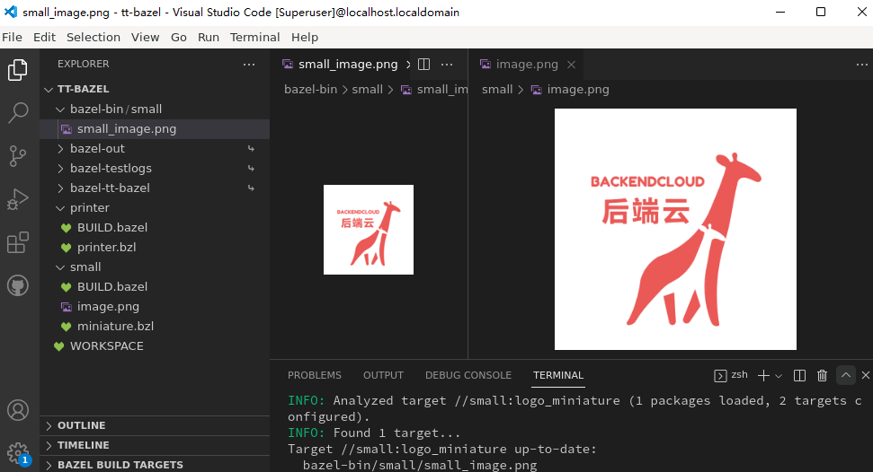

本篇介绍何使用宏和规则扩展 Bazel 的构建语言。

#  在学习更高级的概念之前，先了解以下几个知识点：
* 了解 BUILD 和 .bzl 文件中使用的 Starlark 语言。
* 宏和规则（Macros and rules）。
* BUILD 的三个阶段
* 了解如何在两个 BUILD 文件之间共享变量。


## Starlark 语言

> 参考 <a href="https://www.backendcloud.cn/2022/07/01/bazel-starlark/" target="_blank">https://www.backendcloud.cn/2022/07/01/bazel-starlark/</a>

## 宏和规则（Macros and rules）

宏是实例化规则的函数。当 BUILD 文件过于重复或过于复杂时，它就非常有用，因为它允许您重复使用某些代码。

规则比宏更强大。它可以访问 Bazel 内部信息，并完全掌控将要处理的内容。例如，它可以将信息传递给其他规则。

如果您想重复使用简单的逻辑，请从宏开始。如果宏变得复杂，通常最好使其成为规则。对新语言的支持通常通过规则来实现，例如 rules_go( https://github.com/bazelbuild/rules_go )。规则适用于高级用户，大多数用户永远都不需要编写规则；它们只会加载和调用现有规则。

## BUILD 的三个阶段

加载阶段。规则实例化，将其添加到图表中。

分析阶段。执行规则的代码（其 implementation 函数），并将操作实例化。一个操作描述了如何从一组输入生成一组输出，如“在 hello.c 上运行 gcc 和获取 hello.o”。分析阶段接受由加载阶段生成的图并生成操作图。

执行阶段。需要至少一项输出时，系统才会执行操作。如果文件缺失，或者某个命令无法生成一条输出，则构建会失败。在此阶段可选运行测试。

## 共享变量

着代码库和 BUILD 文件越大，可能会注意到一些重复项，例如：
```bash
cc_library(
  name = "foo",
  copts = ["-DVERSION=5"],
  srcs = ["foo.cc"],
)

cc_library(
  name = "bar",
  copts = ["-DVERSION=5"],
  srcs = ["bar.cc"],
  deps = [":foo"],
)
```

### 同一个BUILD文件使用共享变量
```bash
COPTS = ["-DVERSION=5"]

cc_library(
  name = "foo",
  copts = COPTS,
  srcs = ["foo.cc"],
)

cc_library(
  name = "bar",
  copts = COPTS,
  srcs = ["bar.cc"],
  deps = [":foo"],
)
```

### 不同BUILD文件使用共享变量

在 path/to/variables.bzl 中，写入：

```bash
COPTS = ["-DVERSION=5"]
```

然后，可以在 BUILD 文件以访问变量：

```bash
load("//path/to:variables.bzl", "COPTS")

cc_library(
  name = "foo",
  copts = COPTS,
  srcs = ["foo.cc"],
)

cc_library(
  name = "bar",
  copts = COPTS,
  srcs = ["bar.cc"],
  deps = [":foo"],
)
```

# 下面开始编写几个简单 Bazel BUILD example

创建一个空目录，空WORKSPACE文件，成功执行bazel build，没有报错，只是没有targets，没有做任何build。

```bash
 ⚡ root@localhost  ~  mkdir tb
 ⚡ root@localhost  ~  cd tb
 ⚡ root@localhost  ~/tb  ls
 ⚡ root@localhost  ~/tb  bazel build
WARNING: Invoking Bazel in batch mode since it is not invoked from within a workspace (below a directory having a WORKSPACE file).
ERROR: The 'build' command is only supported from within a workspace (below a directory having a WORKSPACE file).
See documentation at https://docs.bazel.build/versions/main/build-ref.html#workspace
 ✘ ⚡ root@localhost  ~/tb  touch WORKSPACE
 ⚡ root@localhost  ~/tb  bazel build    
Starting local Bazel server and connecting to it...
WARNING: Usage: bazel build <options> <targets>.
Invoke `bazel help build` for full description of usage and options.
Your request is correct, but requested an empty set of targets. Nothing will be built.
INFO: Analyzed 0 targets (0 packages loaded, 0 targets configured).
INFO: Found 0 targets...
INFO: Elapsed time: 2.007s, Critical Path: 0.05s
INFO: 1 process: 1 internal.
INFO: Build completed successfully, 1 total action
```

上面在一个空目录，空文件上跑。下面的是一个简单的打印。

```bash
 ⚡ root@localhost  ~/tt-bazel  cat WORKSPACE 
workspace(name = "src")
 ⚡ root@localhost  ~/tt-bazel  cat printer/printer.bzl 
printer = rule(
    implementation = None,
)
 ⚡ root@localhost  ~/tt-bazel  cat printer/BUILD.bazel 
load("//printer:printer.bzl","printer")
#load("@src//printer:printer.bzl","printer")

printer(
    name = "printer",
)
 ⚡ root@localhost  ~/tt-bazel  bazel build //printer
ERROR: Traceback (most recent call last):
        File "/root/tt-bazel/printer/printer.bzl", line 1, column 15, in <toplevel>
                printer = rule()
Error in rule: rule() missing 1 required positional argument: implementation
ERROR: Skipping '//printer': error loading package 'printer': initialization of module 'printer/printer.bzl' failed
WARNING: Target pattern parsing failed.
ERROR: error loading package 'printer': initialization of module 'printer/printer.bzl' failed
INFO: Elapsed time: 0.305s
INFO: 0 processes.
FAILED: Build did NOT complete successfully (0 packages loaded)
    currently loading: printer
```

> Error in rule: rule() missing 1 required positional argument: implementation

给'printer/printer.bzl'添加 implementation。成功执行bazel build，没有报错，并且包含一个target。

```bash
 ⚡ root@localhost  ~/tt-bazel  cat WORKSPACE 
workspace(name = "src")
 ⚡ root@localhost  ~/tt-bazel  cat printer/printer.bzl 
def _impl(ctx):
    print("called.")


printer = rule(
    implementation = _impl,
)
 ⚡ root@localhost  ~/tt-bazel  cat printer/BUILD.bazel 
load("//printer:printer.bzl","printer")
#load("@src//printer:printer.bzl","printer")

printer(
    name = "printer",
)
 ⚡ root@localhost  ~/tt-bazel  bazel build //printer
DEBUG: /root/tt-bazel/printer/printer.bzl:2:10: called.
INFO: Analyzed target //printer:printer (0 packages loaded, 0 targets configured).
INFO: Found 1 target...
Target //printer:printer up-to-date (nothing to build)
INFO: Elapsed time: 0.229s, Critical Path: 0.00s
INFO: 1 process: 1 internal.
INFO: Build completed successfully, 1 total action
```

> 上面的代码放在： https://github.com/backendcloud/example/blob/master/bazel-extension-demo

上面的 bazel build 就执行一行简单的打印 DEBUG: /root/tt-bazel/printer/printer.bzl:2:10: called.

下面的 bazel build 执行一次图片size的转换。

```bash
 ⚡ root@localhost  ~/tt-bazel  cat small/miniature.bzl 

def miniature(name, src, size="100x100", **kwargs):
  """Create a miniature of the src image.

  The generated file is prefixed with 'small_'.
  """
  native.genrule(
    name = name,
    srcs = [src],
    outs = ["small_" + src],
    cmd = "magick $< -resize " + size + " $@",
    **kwargs
  )

 ⚡ root@localhost  ~/tt-bazel  cat small/BUILD.bazel
load("//small:miniature.bzl","miniature")

miniature(
    name = "logo_miniature",
    src = "image.png",
)
```

```bash
 ⚡ root@localhost  ~/tt-bazel  bazel build //small:logo_miniature 
INFO: Analyzed target //small:logo_miniature (2 packages loaded, 3 targets configured).
INFO: Found 1 target...
ERROR: /root/tt-bazel/small/BUILD.bazel:3:10: Executing genrule //small:logo_miniature failed: (Exit 127): bash failed: error executing command /bin/bash -c 'source external/bazel_tools/tools/genrule/genrule-setup.sh; convert small/image.png -resize 100x100 bazel-out/k8-fastbuild/bin/small/small_image.png'

Use --sandbox_debug to see verbose messages from the sandbox and retain the sandbox build root for debugging
/bin/bash: line 1: convert: command not found
Target //small:logo_miniature failed to build
Use --verbose_failures to see the command lines of failed build steps.
INFO: Elapsed time: 0.239s, Critical Path: 0.04s
INFO: 2 processes: 2 internal.
FAILED: Build did NOT complete successfully
```

> 上面的报错是因为没有magick工具，在 https://imagemagick.org/script/download.php 下载用于处理图片的工具magick。


```bash
 ⚡ root@localhost  ~/tt-bazel  bazel build //small:logo_miniature
INFO: Analyzed target //small:logo_miniature (0 packages loaded, 0 targets configured).
INFO: Found 1 target...
Target //small:logo_miniature up-to-date:
  bazel-bin/small/small_image.png
INFO: Elapsed time: 0.415s, Critical Path: 0.29s
INFO: 2 processes: 1 internal, 1 linux-sandbox.
INFO: Build completed successfully, 2 total actions
```

执行 bazel build 后，bazel-bin/small/small_image.png 路径下生成了个小号的图片



> 上面的代码放在： https://github.com/backendcloud/example/blob/master/bazel-extension-demo

