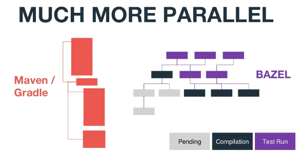
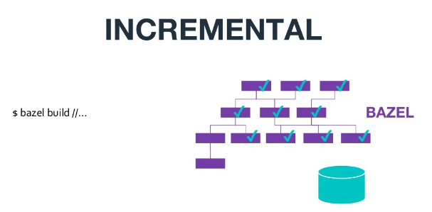
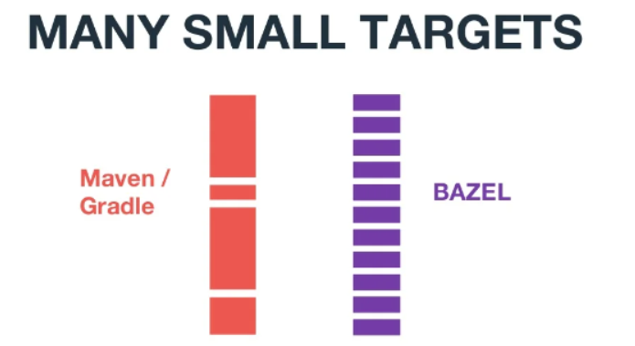
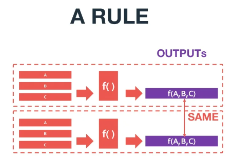
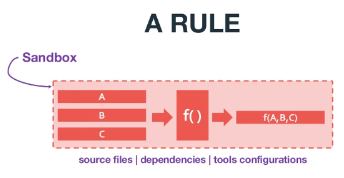
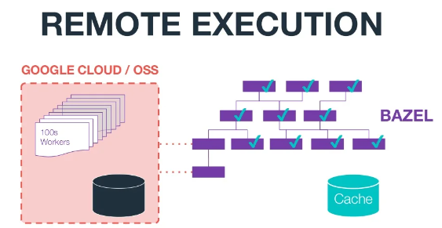
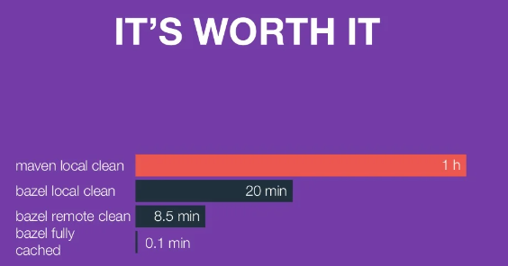

# 简介

# Bazel 是什么

Bazel是一个构建工具, 它可以协调构建各个模块, 并且可以运行单元测试. 它的扩展语言使它可以构建任何类型的计算机语言。

# Bazel 的特性：

* 减少构建时间： 加速你的构建和测试, 有着很好的本地和分布式缓存. 优化的依赖分析和并发执行, 可以快速的增量构建。强大的依赖图实现增量构建。

* 多平台，多语言构建： 它可以构建和测试Java, C++, Android, iOS, Go 和其它各种各样的语言. Bazel 可以运行在 Windows, macOS, 和 Linux上。不同平台可能需要不同的工具。如 C++ 在windows系统中需要使用 msvc 编译器，在 linux 使用 gcc 编译器，为了解决此种问题，bazel 在不同的平台下，自动调用不同工具。

* 颗粒度： 

* 可伸缩的： Bazel可以帮助扩大你的组织, 代码库 和 持续集成系统. 它能处理任意大小的代码库. 也可以处理多个库, 或者巨大的包含许多不同项目的单一代码库。

* 可扩展的： 使用Bazel的扩展语言能轻松的添加对新语言和平台的支持。 你也可以分享和重用bazel社区写的语言规则。

> 有了可扩展到宏和rule，就可以永远不需要输入中间构建步骤；这是语言/平台规则作者的责任。构建步骤隐藏在规则实现中，因此可以只要专注于告诉 Bazel 要构建哪些源。

* 沙盒运行： 沙箱是一种权限限制策略，它将各个进程或系统中的资源隔离开来。当然也可以关闭沙箱。

* 远程执行： 默认情况下，Bazel 在您的本地机器上执行构建和测试。Bazel 构建的远程执行允许您跨多台机器（例如数据中心）分发构建和测试操作，Bazel 使用开源 gRPC 协议 来允许远程执行和远程缓存。远程执行提供以下好处：
  * 通过扩展可用于并行操作的节点来更快地构建和测试执行
  * 为开发团队提供一致的执行环境
  * 在整个开发团队中重用构建输出

* 动态执行： 本地和远程执行相同操作是并行启动的，使用完成的第一个分支的输出，取消另一个分支。它结合了远程构建系统的执行能力和/或大型共享缓存与本地执行的低延迟，为干净和增量构建提供了两全其美的优势。

# 使用 Bazel
要使用 Bazel 构建或测试项目，您通常执行以下操作：

1. 下载并安装 Bazel。
2. 设置一个项目工作区，这是 Bazel 查找构建输入和BUILD文件以及存储构建输出的目录。
3. 编写一个BUILD文件，告诉 Bazel 要构建什么以及如何构建它。
    * BUILD声明构建您可以通过使用Starlark（一种特定于域的语言）目标来编写文件 。
    * 构建目标指定 Bazel 将构建的一组输入artifacts及其依赖项、Bazel 将用于构建它的构建规则以及配置构建规则的选项。
    * 构建规则指定 Bazel 将使用的构建工具，例如编译器和链接器，以及它们的配置。Bazel 附带了许多构建规则，也可以自己编写构建规则。

# Bazel 构建过程
在运行构建或测试时，Bazel 执行以下操作：

1. 加载与目标相关的BUILD文件。
2. 分析输入及其 依赖关系，应用指定的构建规则，并生成操作图。
3. 对输入执行构建操作，直到生成最终构建输出。

由于所有以前的构建工作都被缓存，Bazel 可以识别和重用缓存的artifacts，并且只重建或重新测试更改的内容。为了进一步确保正确性，您可以设置 Bazel 以 通过沙盒密封运行构建和测试，从而最大限度地减少偏差并最大限度地提高可重复性。